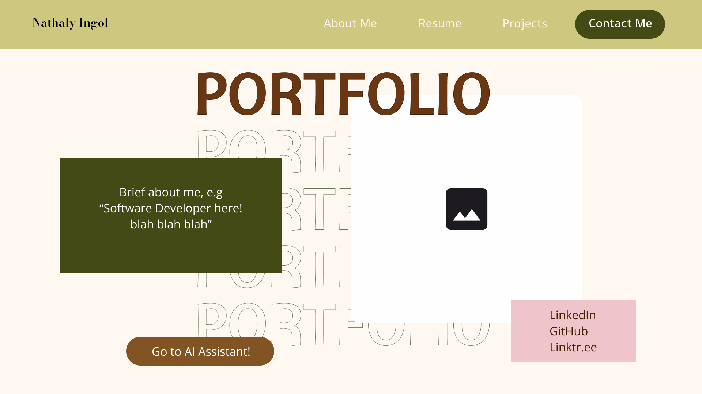

<div align="center">

# 🌸 Nathaly Ingol - Portfolio

**Software Developer . Data Engineer . AI/ML Enthusiast**

*CS Senior @ Texas State University . Austin, TX*

[](https://nathalyingol.netlify.app)
&nbsp;
[](https://astro.build)
&nbsp;
[](https://tailwindcss.com)

</div>

---

## ✨ About This Portfolio

A personal portfolio website - designed with a warm earthy aesthetic (cream, olive, brown & blush tones) to showcase my projects, skills, and professional journey. Features a custom AI assistant (COCO) powered by Gemini 2.5 Flash.

---

## 🗂️ Pages

| Page | Route | Description |
|------|-------|-------------|
| 🏠 Home | `/` | Hero section with intro, social links & AI assistant CTA |
| 👩‍💻 About Me | `/about` | Personal story, hobbies, photography & dog 🐶 |
| 📄 Resume | `/resume` | Education, experience, skills — downloadable PDF + virtual view |
| 🖨️ Virtual Resume | `/virtual-resume` | Clean printable resume |
| 🛠️ Projects | `/projects` | 8 project showcase with live demo & GitHub links |
| 📬 Contact | `/contact` | Contact form (Web3Forms) + social/email info |
| 🤖 AI Assistant | `/assistant` | COCO — AI chatbot about Nathaly, powered by Gemini 2.5 Flash |

---

## 🚀 Tech Stack

| Layer | Technology |
|-------|-----------|
| Design | [Figma](https://figma.com) |
| Framework | [Astro](https://astro.build) v5 |
| Styling | [Tailwind CSS](https://tailwindcss.com) v4 + scoped CSS per page |
| Components | React 19 (interactive islands) |
| AI | Google Gemini 2.5 Flash (`@google/generative-ai`) |
| Forms | Web3Forms |
| Fonts | Bebas Neue . Playfair Display . DM Sans (Google Fonts) |
| Deployment | Netlify |
| SEO | Open Graph . JSON-LD . canonical URLs . sitemap |

---

## 🎨 Figma Design

The entire portfolio was designed in Figma before a single line of code was written, from layout and color palette to component structure and typography.

[Check Figma Project Design!](https://www.figma.com/design/tymqx16WyKL5s21Ox1b8Y5/web?node-id=0-1&t=o7R2blU90Fzipt8K-1)

<table>
  <tr>
    <td></td>
  </tr>
</table>

---

## 🗃️ Project Structure

```text
portfolio/
├── public/
│   ├── AI/
│   │   └── COCO_AI_Script.pdf   ← context document for COCO AI
│   ├── documents/               ← downloadable resume PDF
│   └── images/                  ← static images (og-cover, projects, photos)
├── src/
│   ├── components/
│   │   ├── Navbar.astro
│   │   ├── Footer.astro
│   │   └── CocoChat.tsx         ← Gemini-powered chat React component
│   ├── layouts/
│   │   └── BaseLayout.astro     ← shared HTML head (SEO meta, fonts, custom cursor)
│   ├── pages/
│   │   ├── index.astro          ← Home
│   │   ├── about.astro
│   │   ├── resume.astro
│   │   ├── virtual-resume.astro
│   │   ├── projects.astro
│   │   ├── contact.astro
│   │   └── assistant.astro
│   └── styles/
│       └── global.css           ← design tokens, base styles, custom cursor
├── astro.config.mjs
├── package.json
└── tsconfig.json
```

---

## 🛠️ Getting Started

### Prerequisites
- Node.js `>=18`
- npm

### Installation

```bash
git clone https://github.com/coconath0/portfolio.git
cd portfolio
npm install
npm run dev
```

Open [http://localhost:4321](http://localhost:4321) in your browser. 🎉

### Build for Production

```bash
npm run build      # outputs to /dist
npm run preview    # preview the production build locally
```

---

## 🔑 Environment Variables

Create a `.env` file at the project root:

```env
PUBLIC_WEB3FORMS_KEY=your_web3forms_access_key
PUBLIC_GEMINI_KEY=your_gemini_api_key
```

| Variable | Where to get it |
|----------|----------------|
| `PUBLIC_WEB3FORMS_KEY` | [web3forms.com](https://web3forms.com) |
| `PUBLIC_GEMINI_KEY` | [Google AI Studio](https://aistudio.google.com/apikey) |

> Set the same variables in your **Netlify → Site settings → Environment variables** for production.

---

## 🎨 Design Tokens

| Token | Value | Usage |
|-------|-------|-------|
| `--cream` | `#F5F0E8` | Page backgrounds |
| `--olive` | `#CDC77F` | Navbar, accents, chips |
| `--olive-dark` | `#434A15` | Dark section backgrounds |
| `--brown` | `#693714` | Headings, CTAs |
| `--brown-dark` | `#402203` | Footer, deep backgrounds |
| `--blush` | `#E8C4C8` | Highlights, social card |

---

## 🔍 SEO

- ✅ Semantic HTML & proper heading hierarchy
- ✅ Open Graph & Twitter card meta tags
- ✅ JSON-LD structured data (`Person` schema)
- ✅ Canonical URLs via `Astro.site`
- ✅ `robots` meta: `index, follow`
- ✅ Descriptive `alt` attributes on all images

---

## 💬 COCO AI Assistant

COCO is a Gemini 2.5 Flash–powered chatbot scoped exclusively to my portfolio context. On load it fetches `public/AI/COCO_AI_Script.pdf`, base64-encodes it, and passes it as an inline document in the chat history. Giving Gemini full context about my background, projects, and skills before the first user message. Responses are streamed in real time.

---

## 📬 Contact

- 💼 [linkedin.com/in/nathaly-ingol-leon](https://linkedin.com/in/nathaly-ingol-leon)
- 🐙 [github.com/coconath0](https://github.com/coconath0)
- 🌿 [linktr.ee/nathalyingol](https://linktr.ee/nathalyingol)

---

<div align="center">
  <sub>Made with ☕, code & way too many tabs open 🌸</sub>
</div>
